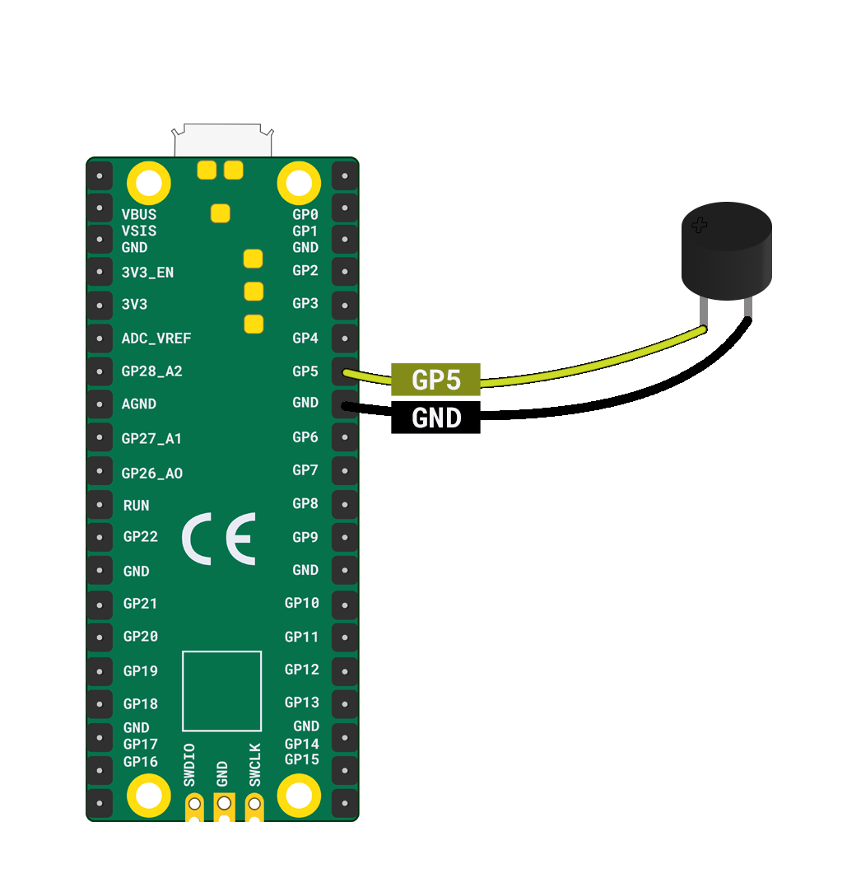

You will need:

+ A Raspberry Pi Pico
+ A **passive** tone buzzer
+ 2 x socket-socket jumper wires

To wire a single buzzer to a Raspberry Pi Pico, connect the **positive** leg to pin **GP5** and the **negative** leg to the nearest **GND** pin.

**Tip**: You can identify the positive leg by looking for the longest leg or by finding the side with a **+** sign at the top.

