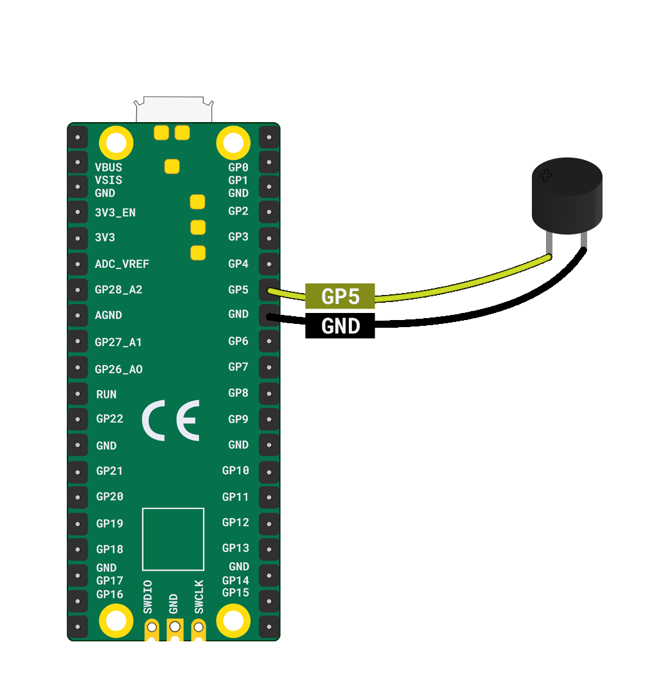

Je hebt nodig:

+ Een Raspberry Pi Pico
+ Een **passieve** toonzoemer
+ 2 x bus-bus jumperdraden

Om een zoemer op een Raspberry Pi Pico aan te sluiten, verbind je de **positieve** poot met pin **GP5** en de **negatieve** poot met de dichtstbijzijnde **GND**-pin.

**Tip**: Je kunt de positieve poot vinden door te zoeken naar het langste deel of door de zijde te vinden met een **+** teken aan de bovenkant.

